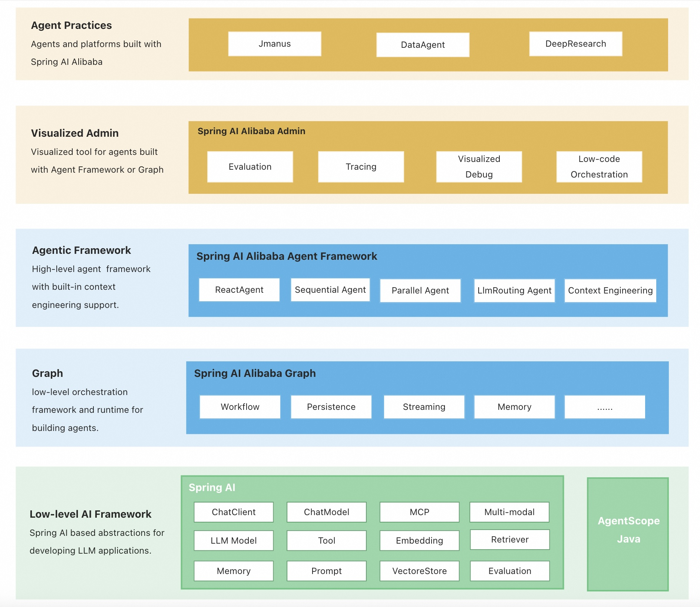

# Agentic Framework for Java

> **Provides everything from ReactAgent to complex Multi Agent, Workflow with graph-based orchestration.**  

📜 [official documentation](https://java2ai.com/)

---

## Overview

🚀 Spring AI Alibaba is dedicated to providing a framework and ecosystem for Java developers to build, orchestrate, and deploy AI agents.

## Spring AI Alibaba's Ecosystem

 Projects | Description | Usage Guide
  --- | --- | ---
| [Spring AI Alibaba Agent Framework](https://github.com/alibaba/spring-ai-alibaba/tree/main/spring-ai-alibaba-agent-framework) |  🚀 Framework for building agent and multi-agent applications, with embedded context engineering support.  | Focus on Agent building, using   - Graph as the runtime   - Spring AI as the LLM model. 
| [Spring AI Alibaba Graph](https://github.com/alibaba/spring-ai-alibaba/tree/main/spring-ai-alibaba-graph-core) | A low-level orchestration framework and runtime for building, managing, and deploying long-running, stateful agents. | For advanced use cases that need more control over the Agent or Multi-agent process.
| [Spring AI Alibaba Admin](https://github.com/spring-ai-alibaba/spring-ai-alibaba-admin) |  Local visualization toolkit for the development of agent applications, supporting project management, runtime visualization, tracing, and agent evaluation. | Visualized tool for agents built with Agent Framework or Graph.
| [Spring AI Extensions](https://github.com/spring-ai-alibaba/spring-ai-extensions) | Extended implementations for Spring AI core concepts, including DashScopeChatModel, MCP registry, etc. |  Extension for Spring AI, providing basic abstraction for building LLM applications, for example, model, tool, mcp, vector store, etc.

## High-level Architecture

    

## More Projects
 Repository | Description | ⭐
  --- | --- | ---
| [Spring AI Alibaba Agent Framework](https://github.com/alibaba/spring-ai-alibaba/tree/main/spring-ai-alibaba-agent-framework) |  🚀 Framework for building agent and multi-agent applications, with embedded context engineering support.  | 
| [Spring AI Alibaba Graph](https://github.com/alibaba/spring-ai-alibaba/tree/main/spring-ai-alibaba-graph-core) | A low-level orchestration framework and runtime for building, managing, and deploying long-running, stateful agents. | 
| [Spring AI Alibaba Admin](https://github.com/spring-ai-alibaba/spring-ai-alibaba-admin) |  Local visualization toolkit for the development of agent applications, supporting project management, runtime visualization, tracing, and agent evaluation. | 
| [Spring AI Extensions](https://github.com/spring-ai-alibaba/spring-ai-extensions) | Extended implementations for Spring AI core concepts, including DashScopeChatModel, MCP registry, etc. |  
| [Spring AI Alibaba Examples](https://github.com/spring-ai-alibaba/examples) | Spring AI Alibaba Examples. |  
| [JManus](https://github.com/spring-ai-alibaba/jmanus) | A Java implementation of Manus built with Spring AI Alibaba, currently used in many applications within Alibaba Group. | 
| [DataAgent](https://github.com/spring-ai-alibaba/dataagent) | A natural language to SQL project based on Spring AI Alibaba, enabling you to query databases directly with natural language without writing complex SQL. | 
| [DeepResearch](https://github.com/spring-ai-alibaba/deepresearch) |  Deep Research implemented based on spring-ai-alibaba-graph. | 

## Star History

